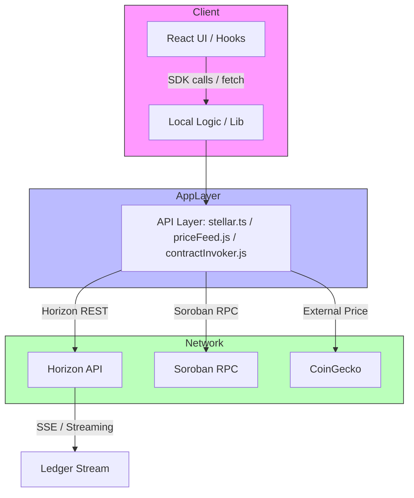

# API Integration Documentation

This document collects all integration points for Stellar Horizon, Soroban RPC, and external services used by Stellar Dev Dashboard. It includes architecture diagrams, endpoint usage, Soroban invocation flows, rate limiting and retry strategies, error handling patterns, external API fallbacks, mock data for development, and an SDK migration guide.

**Location:** docs/api/README.md

---

**Contents**
- Architecture overview
- Horizon API endpoints and examples
- Soroban RPC interactions and contract invocation flow
- Rate limiting strategies and best practices
- Error handling patterns and mapping
- External API integrations and fallbacks (CoinGecko, Friendbot, etc.)
- Mock data for development
- SDK migration guide

---

**Acceptance checklist**
- Architecture diagram of API layers — present
- Horizon API endpoint usage documented — present
- Soroban contract invocation flow documented — present
- Rate limiting strategies documented — present
- Error handling patterns documented — present
- External API integration points and fallbacks — present
- Mock data for development documented — present
- Migration guide for SDK version updates — present

---

**Architecture (API Layers)**



Notes:
- The `lib/stellar.ts` file is the canonical connector layer for Horizon and Soroban RPC interactions. UI components and hooks call exported helpers from this file.
- `priceFeed.js` calls CoinGecko and caches results; `streaming.js` manages SSE ledger streaming.

---

**Horizon API Endpoint Usage**

Primary Horizon base URLs (configured in `src/lib/stellar.ts`):
- Mainnet: `https://horizon.stellar.org`
- Testnet: `https://horizon-testnet.stellar.org`
- Futurenet: `https://horizon-futurenet.stellar.org`
- Local: `http://localhost:8000`

Common endpoints used by the dashboard:

- GET /accounts/{account_id}
  - Purpose: Fetch account balances, thresholds, signers, sequence number, etc.
  - Example (curl):

```bash
curl -s "https://horizon-testnet.stellar.org/accounts/G..." | jq .
```

- GET /transactions/{tx_hash}
  - Purpose: Fetch transaction details including envelope_xdr, result_xdr, memo, fee_paid.

- GET /operations?account={account_id}&limit=20&order=desc
  - Purpose: List recent operations; used for the operations tab with cursor-based pagination.

- GET /ledgers?limit=10
  - Purpose: Show recent ledgers and fee stats.

- GET /order_book?selling_asset_type=...&buying_asset_type=...
  - Purpose: DEX order book for `DEXExplorer`.

- POST /transactions (Horizon submits signed XDR)
  - Purpose: Submit a signed transaction XDR to Horizon for inclusion.

- GET /paths/strict-send and /paths/strict-receive
  - Purpose: Path finding for cross-asset payments.

- GET /trades and /offers
  - Purpose: Historical trade list and active offers per account.

- GET /effects and /payments
  - Purpose: Supplemental activity feed and UI annotations.

Horizon usage patterns and tips:
- Use cursor-based pagination for large lists: keep `next`/`prev` links returned in response and store cursors in the client state.
- Coalesce parallel requests: when multiple components request the same account data, share a single promise/cached response.
- For sensitive operations (submit), always show the constructed XDR to the user and allow them to sign using an external wallet (Freighter/Ledger) rather than exposing secret keys in the app.

Example: Fetch account and first 20 transactions in parallel (JS, using @stellar/stellar-sdk):

```js
import { Server } from "@stellar/stellar-sdk";
const server = new Server("https://horizon-testnet.stellar.org");

async function loadAccountAndTxs(publicKey) {
  const accountPromise = server.accounts().accountId(publicKey).call();
  const txPromise = server.transactions().forAccount(publicKey).limit(20).order("desc").call();
  const [account, txs] = await Promise.all([accountPromise, txPromise]);
  return { account, txs };
}
```

Horizon rate limit headers (example):
- `X-RateLimit-Limit`: total allowed
- `X-RateLimit-Remaining`: remaining requests
- `X-RateLimit-Reset`: seconds until reset

Handle 429 (Too Many Requests) by respecting `Retry-After` or `X-RateLimit-Reset` where provided.

---

**Soroban RPC Interactions & Contract Invocation Flow**

Soroban RPC is used for inspecting contracts, simulating contract calls, preparing transactions, and sending signed transactions (when allowed).

Primary RPC endpoints configured in `src/lib/stellar.ts`:
- Testnet: `https://soroban-testnet.stellar.org`
- Mainnet: `https://soroban-rpc.stellar.org`
- Local: `http://localhost:8000/soroban/rpc`

Common Soroban RPC methods used:
- `getHealth` / `getLatestLedger` — for health checks and syncing
- `simulateTransaction` — simulate a transaction and receive cost, events, and footprint
- `prepareTransaction` — build a transaction skeleton with necessary network info
- `sendTransaction` — submit a serialized signed transaction to the network
- `getEvents` — query contract events

Soroban contract invocation canonical flow (sequence):

```mermaid
sequenceDiagram
  participant UI as Client UI
  participant Lib as lib/contractInvoker.js
  participant RPC as Soroban RPC
  participant Horizon as Horizon
  UI->>Lib: Build call params (contract, fn, args, source)
  Lib->>RPC: simulateTransaction (unsigned)
  RPC-->>Lib: simulation (cost, result, events, footprint)
  Lib-->>UI: show simulation results + footprint
  UI->>Lib: User requests submit (Testnet) or signs via wallet
  alt wallet-sign
    Lib->>UI: return prepared XDR -> Wallet signs -> Signed XDR -> Lib
  else local-secret
    Lib: sign locally with secret
  end
  Lib->>RPC: sendTransaction (signed XDR)
  RPC-->>Lib: tx hash + status
  Lib->>Horizon: optional /transactions/{hash} to fetch expanded result
  Lib-->>UI: show tx result
```

Notes and best practices:
- Always call `simulateTransaction` before submitting — it reveals cost, footprint, and return values without changing chain state.
- Show footprint read-only/read-write keys to the user; inform them about potential ledger changes.
- For Mainnet safety, submissions are disabled in the UI; only simulation is allowed.
- Use `prepareTransaction` to obtain canonical transaction bytes that wallets like Freighter can sign.

JS example: simulate and prepare (using @stellar/stellar-sdk v12):

```js
import { SorobanClient, Server, Keypair } from "@stellar/stellar-sdk";
const sorobanServer = new SorobanClient.Server("https://soroban-testnet.stellar.org");
const horizonServer = new Server("https://horizon-testnet.stellar.org");

async function simulateContractCall(sourceKey, contractId, funcName, scArgs) {
  const kp = Keypair.fromPublicKey(sourceKey);
  const simulateRes = await sorobanServer.simulateTransaction({
    // The SDK helper to produce an unsigned tx XDR is used here (pseudo)
    // Build the transaction using TransactionBuilder + contract invocation
  });
  return simulateRes; // cost, events, footprint
}
```

Soroban RPC errors: treat them as higher-level RPC errors. Map HTTP 400/500 into user-friendly messages and show simulation `logs` when present.

---

**Rate Limiting Strategies**

Server-side Horizon rate limits are enforced network-wide. The dashboard should implement client-side strategies to avoid hitting limits and to gracefully back off.

Recommended strategies:

- Request Coalescing
  - Merge identical concurrent requests into a single network call and share the returned promise.

- Caching
  - Short-term cache account + price responses (e.g., 30s for accounts, 60s for prices).
  - Use ETag / If-None-Match patterns where supported.

- Exponential Backoff + Jitter
  - On 429/5xx: retry with exponential backoff (base 500ms, max 30s) and random jitter to reduce thundering herd.

- Respect Retry Headers
  - Honor `Retry-After` or `X-RateLimit-Reset` when provided by the server.

- Circuit Breaker
  - If a particular endpoint yields persistent 5xx/429, open a short circuit (e.g., 1–5 minutes) and surface degraded UI with cached data.

- Token Bucket (client-side)
  - Implement a small token bucket to limit the rate of outgoing requests from UI actions (e.g., throttling search inputs, path queries).

Implementation snippet (pseudo):

```js
// simple coalesce cache
const promiseCache = new Map();
function coalescedFetch(key, fn) {
  if (promiseCache.has(key)) return promiseCache.get(key);
  const p = fn().finally(() => promiseCache.delete(key));
  promiseCache.set(key, p);
  return p;
}
```

---

**Error Handling Patterns**

Map low-level Horizon and Soroban errors into clear categories for the UI:

- Client errors (4xx)
  - 400 Bad Request: invalid parameters — show validation hints.
  - 401 Unauthorized: wallet not connected / access denied — prompt to connect wallet.
  - 404 Not Found: resource not found — show friendly "not found" view.
  - 429 Too Many Requests: rate limited — show retry countdown and use cached data.

- Server errors (5xx)
  - 500–599: transient backend errors — retry with exponential backoff and show degraded mode.

- Horizon transaction result codes
  - Parse `result_xdr` with SDK helpers to show human readable failure reasons (e.g., `tx_failed`, `op_no_destination`)

Example: decode a failed transaction result (JS):

```js
import { xdr } from "@stellar/stellar-sdk";

function decodeTxResult(resultXdr) {
  try {
    const res = xdr.TransactionResult.fromXDR(resultXdr, "base64");
    // Map result codes to messages
  } catch (e) {
    // fallback: display raw XDR and link to docs
  }
}
```

UI patterns:
- Surface a concise summary (title + short reason) and an expandable detail panel containing raw JSON/XDR for advanced users.
- For Soroban simulation errors, display `logs`, `events`, and the footprint to help debugging.
- For rate limits, show next retry time and provide a "Try again" button that follows a backoff schedule.

---

**External API Integrations & Fallbacks**

CoinGecko — primary price provider (used by `priceFeed.js`):
- Endpoint: `https://api.coingecko.com/api/v3/simple/price` with asset id mapping maintained in `src/lib/priceFeed.js`.

Integration notes:
- Map non-native assets to CoinGecko IDs via `ASSET_ID_MAP`. If an asset is not mapped, fall back to SDEX order book midpoint as price estimate.
- Cache CoinGecko responses for 60s.
- Handle CoinGecko rate limits: they can be strict — implement exponential backoff and a local cache; consider a secondary fallback provider like CoinMarketCap or a hosted price service.

Friendbot (Testnet faucet):
- Endpoint: `https://friendbot.stellar.org?addr=<publicKey>`
- Only used in Testnet; UI gating must hide or disable on Mainnet.

Fallback strategy summary:
- Primary: CoinGecko cached API
- Secondary: SDEX-based price from order book midpoint
- Tertiary: Local mock prices (development)

Example CoinGecko call (curl):

```bash
curl -s "https://api.coingecko.com/api/v3/simple/price?ids=stellar&vs_currencies=usd&include_24hr_change=true"
```

---

**Mock Data for Development**

Keep a `tests/mocks/` or `docs/api/mocks/` directory with sample JSON responses. Example mock snippets below can be used to drive UI components without network access.

Sample `account.json` (simplified):

```json
{
  "id": "GA...",
  "account_id": "G...",
  "sequence": "1234567890",
  "balances": [
    { "asset_type": "native", "balance": "1000.1234567" },
    { "asset_type": "credit_alphanum4", "asset_code": "USDC", "asset_issuer": "G...", "balance": "250.00" }
  ],
  "signers": [],
  "flags": {}
}
```

Sample `transaction_simulation.json` (Soroban simulate response excerpt):

```json
{
  "status": "success",
  "cost": { "cpu_insns": 1024, "mem_bytes": 2048 },
  "events": [],
  "result": { "xdr": "..." },
  "footprint": { "read_only": [], "read_write": [] }
}
```

Store these fixtures under `tests/mocks/horizon/` and `tests/mocks/soroban/` so unit and integration tests can import them.

---

**SDK Migration Guide (example: upgrading @stellar/stellar-sdk to a newer major)**

Before upgrading:
- Read the SDK release notes and changelog for breaking changes.
- Add a feature branch and lock current version in `package.json`.
- Run full test suite and note failing areas.

Upgrade steps:

1. Update `package.json` dependency: `@stellar/stellar-sdk@^12.0.0` (or target version).
2. Run `pnpm install` (or `npm install`) and resolve peer dependency warnings.
3. Search the codebase for deprecated API patterns (e.g., removed helper names, changed method signatures).
4. Update Soroban-related imports/usage: some helper names changed in v12; prefer explicit `SorobanClient.Server` usage where appropriate.
5. Run TypeScript checks and fix type mismatches (update `tsconfig` target if needed).
6. Run unit and integration tests, fix failing tests.
7. Manually test Soroban flows (simulate, prepare, send) on Testnet.
8. Update `docs/api/README.md` with any new or renamed SDK helpers used in the repo.

Example commit checklist:
- Bump dependency
- Fix imports/usage
- Update mocks/tests
- Manual test on Testnet
- Document changes in this file

Common pitfalls:
- Breaking changes around Soroban helpers and XDR parsing.
- Type changes requiring explicit casts in TypeScript files under `src/lib/`.

---

**Operational Examples & Troubleshooting**

- If transactions stall after `sendTransaction`, poll Horizon `/transactions/{hash}` and `/operations` for finality. Use `effects` to detect ledger inclusion.
- If Soroban `simulateTransaction` returns an unexpected footprint, re-evaluate argument encoding to `ScVal` types (string vs address vs bytes).
- When decoding XDR errors, use SDK `xdr.SuperStruct` helpers and provide a link to XDR docs for advanced users.

---

**Where this lives in the repo**
- Implementation connectors: [src/lib/stellar.ts](src/lib/stellar.ts#L1) (Horizon + network config)
- Soroban helpers: [src/lib/contractInvoker.js](src/lib/contractInvoker.js#L1)
- Price feed: [src/lib/priceFeed.js](src/lib/priceFeed.js#L1)
- Streaming: [src/lib/streaming.js](src/lib/streaming.js#L1)

Replace the line numbers above with actual references if needed.

---

If you want, I can also:
- Add the JSON mock files under `tests/mocks/` and wire them into the test harness.
- Create a small Visual sequence diagram PNG/SVG and include it in `docs/api/`.

---

Document last updated: 2026-06-01
# Stellar Dev Dashboard — API Reference

This directory documents the public JavaScript modules exposed by the dashboard.

## Modules

| Module | Description |
|--------|-------------|
| [stellar.js](./stellar.md) | Horizon & Soroban RPC wrappers with caching and rate limiting |
| [storage.js](./storage.md) | Persistent IndexedDB storage with localStorage fallback |
| [encryption.js](./encryption.md) | AES-GCM encryption for sensitive local data |
| [tutorialSystem.js](./tutorial.md) | Guided tours and contextual help system |
| [multisig.js](./multisig.md) | Multi-signature transaction coordination |
| [priceFeed.js](./priceFeed.md) | XLM and asset price feeds |
| [transactionBuilder.js](./transactionBuilder.md) | Multi-operation transaction builder and simulator |
| [transactionTemplates.js](./transactionTemplates.md) | Pre-built transaction templates |
| [import.js / export.js](./dataExport.md) | Dashboard backup, export, and import utilities |

## Quick Start

```js
import { fetchAccount, fetchTransactions } from './src/lib/stellar';
import { getStoredValue, setStoredValue } from './src/lib/storage';
import { encrypt, decrypt } from './src/lib/encryption';
```

## Authentication & Keys

Never store secret keys in plaintext. Use the `encrypt` module to store sensitive data:

```js
import { encrypt, decrypt } from './src/lib/encryption';

// Encrypt before storing
const { ciphertext, iv, salt } = await encrypt(secretKey, userPassphrase);
await setStoredValue('encrypted_key', { ciphertext, iv, salt });

// Decrypt when needed
const stored = await getStoredValue('encrypted_key');
const secretKey = await decrypt(stored.ciphertext, userPassphrase, stored.iv, stored.salt);
```

## Rate Limiting

All Horizon API calls are rate-limited per identifier (user ID or IP). The default limit is configurable in `src/lib/rateLimiter.js`. When a limit is exceeded, calls throw an error with `error.statusCode === 429` and `error.retryAfter` in milliseconds.

## Caching

API responses are cached in IndexedDB with configurable TTLs:

| Data Type | Default TTL |
|-----------|-------------|
| Account | 60 seconds |
| Transactions | 30 seconds |
| Ledger | 5 seconds |
| Assets | 5 minutes |
| Network stats | 1 hour |
| XLM price | 30 seconds |

## Networks

```js
import { NETWORKS } from './src/lib/stellar';

// NETWORKS.mainnet — production Stellar network
// NETWORKS.testnet — test network (free, safe for development)
```
